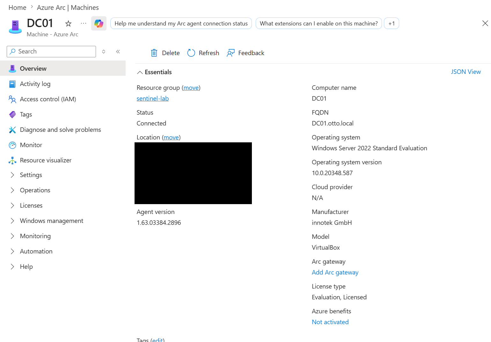
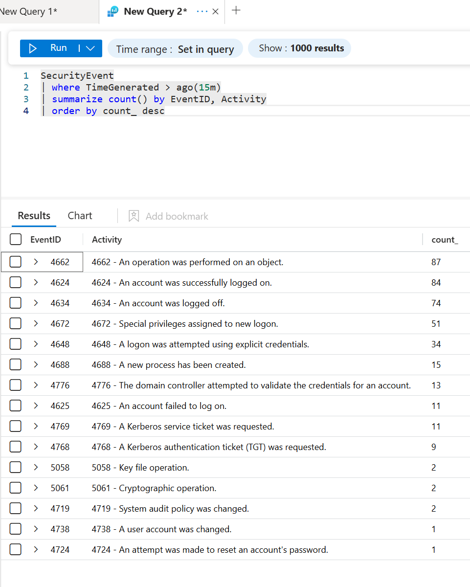
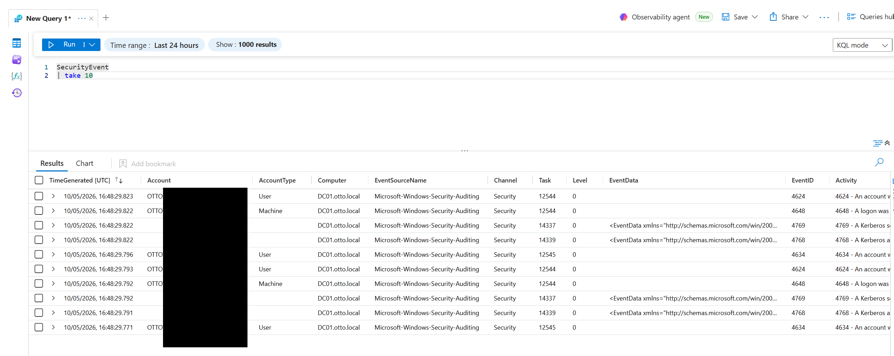
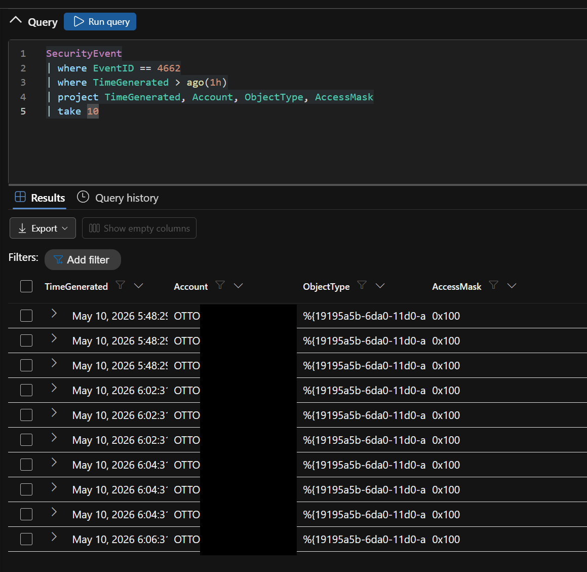
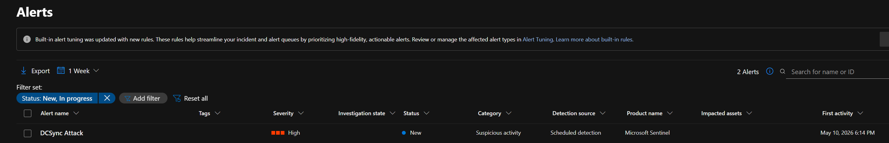
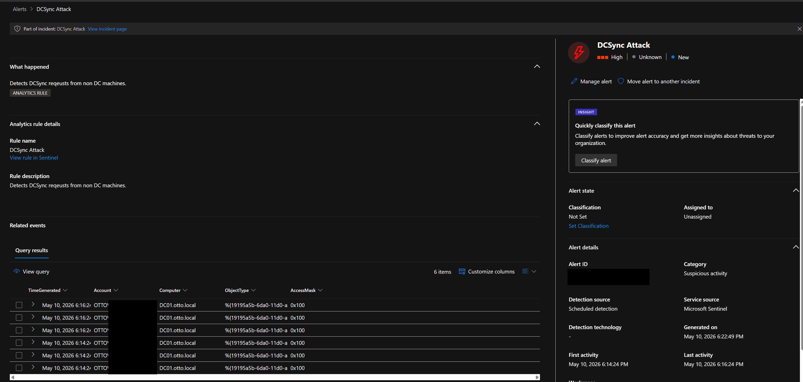
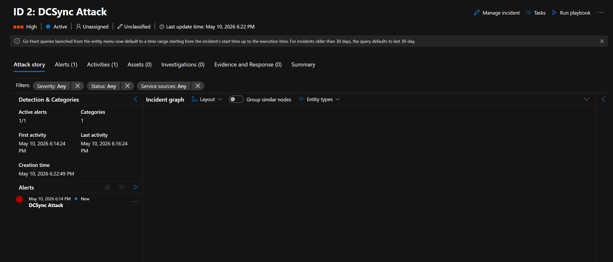
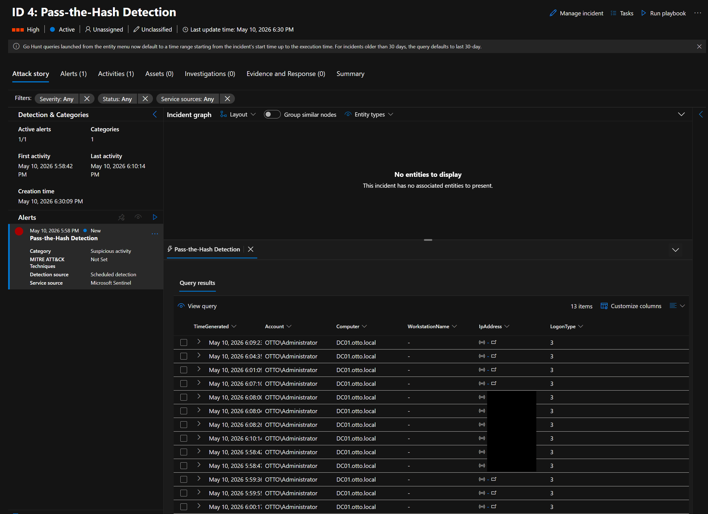
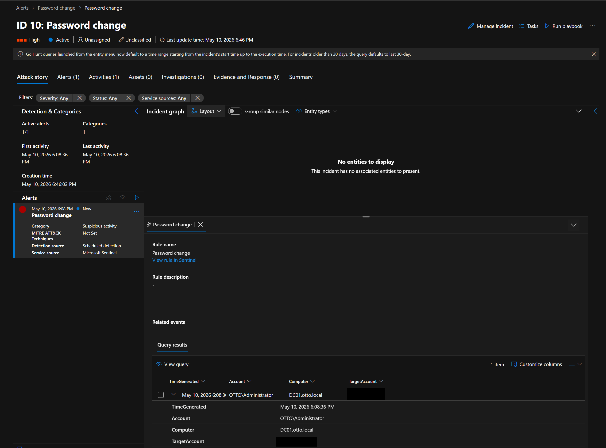
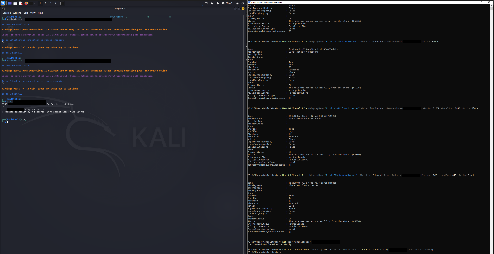

# microsoft-sentinel-detection-lab

This lab continues from [azure-ad-hybrid-identity-attack-lab](https://github.com/otto-youds/azure-ad-hybrid-identity-attack-lab) where on-premises AD was fully compromised and pivoted to Entra ID via AD Connect PHS abuse. This lab picks up from that position and builds a blue team detection layer on top of the same environment using Microsoft Sentinel. Three custom KQL detection rules were written, all three fired, and a full incident response process was followed through to closure.

## Environment

| Machine | OS | Role |
| --- | --- | --- |
| Kali Linux | Kali Rolling | Attacker |
| DC01 | Windows Server 2022 | Domain Controller |
| PC01 | Windows 11 | Domain workstation |
| Microsoft Sentinel | Azure | SIEM |
| Microsoft Defender Portal | security.microsoft.com | Unified SOC portal |

Sentinel Workspace: sentinel-lab-work  
Resource Group: sentinel-lab  
Location: UK South

## Tools and Services

| Tool / Service | Purpose |
| --- | --- |
| Microsoft Sentinel | Cloud SIEM, log ingestion, analytics rules, incident management |
| Microsoft Defender Portal | Unified SOC portal for incident investigation and response |
| Azure Arc | Connected DC01 as an on-prem VM to Azure management plane |
| Azure Monitor Agent | Log collection from DC01 to Log Analytics workspace |
| KQL | Detection rules and threat hunting queries |
| impacket-secretsdump | DCSync attack replay |
| Evil-WinRM | Pass-the-hash lateral movement replay |
| Windows Firewall | Manual containment of attacker IP |

## Phase 1: Sentinel Deployment

A Log Analytics workspace was created in UK South on pay-as-you-go pricing. Microsoft Sentinel was added to the workspace via the Azure portal and then migrated to the Microsoft Defender portal at security.microsoft.com which is the unified SIEM and XDR platform Microsoft is moving Sentinel into. The Windows Security Events content pack was installed from the content hub to enable Windows event log ingestion.

## Phase 2: DC01 Connected via Azure Arc

DC01 is an on-premises VM running in VirtualBox so it isn't a native Azure resource. Azure Arc was used to register it as a managed machine in Azure so Sentinel could collect its logs.

```powershell
Invoke-WebRequest -Uri "https://aka.ms/azcmagent-windows" -OutFile "C:\Windows\Temp\install_windows_azcmagent.ps1"
& "C:\Windows\Temp\install_windows_azcmagent.ps1"

& "C:\Program Files\AzureConnectedMachineAgent\azcmagent.exe" connect `
  --tenant-id "<redacted>" `
  --subscription-id "<redacted>" `
  --resource-group "sentinel-lab" `
  --location "uksouth"
```

DC01 showed as Connected in Azure Arc with full machine details including OS, FQDN and agent version.



Azure Monitor Agent was installed on DC01 via Azure Arc and a Data Collection Rule was created in Sentinel targeting DC01 to collect all Security Events.

## Phase 3: Audit Policy

Windows audit policy was configured on DC01 to make sure all relevant events were being logged.

```powershell
auditpol /set /subcategory:"Logon" /success:enable /failure:enable
auditpol /set /subcategory:"Account Logon" /success:enable /failure:enable
auditpol /set /subcategory:"Account Management" /success:enable /failure:enable
auditpol /set /subcategory:"Directory Service Access" /success:enable /failure:enable
auditpol /set /subcategory:"Privilege Use" /success:enable /failure:enable
auditpol /set /subcategory:"Process Creation" /success:enable /failure:enable
```

## Phase 4: Attack Replay

Attacks from the previous lab were replayed from Kali to generate logs with the AMA pipeline now active.

```bash
# DCSync
impacket-secretsdump administrator@<DC01> -hashes <lm>:<ntlm>

# Pass-the-Hash
evil-winrm -i <DC01> -u administrator -H <hash>

# Password Reset
Set-ADAccountPassword -Identity <user> -Reset -NewPassword (ConvertTo-SecureString "<password>" -AsPlainText -Force)

# Failed logons
evil-winrm -i <DC01> -u <user> -p '<password>'
```

Event distribution confirmed in Sentinel:

| Event ID | Description | Count |
| --- | --- | --- |
| 4662 | Directory object operation (DCSync) | 87 |
| 4624 | Successful logon | 84 |
| 4634 | Logoff | 74 |
| 4672 | Special privileges assigned | 51 |
| 4648 | Explicit credential logon | 34 |
| 4688 | Process creation | 15 |
| 4625 | Failed logon | 11 |
| 4724 | Password reset attempt | 1 |



Initial log ingestion confirmed with a raw SecurityEvent query:



Threat hunting query used to verify event distribution across attack types:



## Phase 5: Detection Rules

Three custom KQL analytics rules were created in Microsoft Sentinel. All rules set to High severity, running every 5 minutes with a 1 hour lookback.

**Rule 1: DCSync Attack**

```kql
SecurityEvent
| where EventID == 4662
| where AccessMask == "0x100"
| where Account !endswith "$"
| project TimeGenerated, Account, Computer, ObjectType, AccessMask
```

The ObjectType field returns a GUID in this environment rather than the string "domainDNS" so the ObjectType filter was removed to ensure matching.

**Rule 2: Pass-the-Hash Detection**

```kql
SecurityEvent
| where EventID == 4624
| where LogonType == 3
| where AuthenticationPackageName == "NTLM"
| where AccountName !endswith "$"
| where WorkstationName != Computer
| project TimeGenerated, Account, Computer, WorkstationName, IpAddress, LogonType
```

**Rule 3: Password Reset Detection**

```kql
SecurityEvent
| where EventID == 4724
| project TimeGenerated, Account, Computer, TargetAccount
```

## Phase 6: Incidents Generated

All three rules fired and generated incidents in the Microsoft Defender portal.

**Incident 2: DCSync Attack**

Severity: High, Detection source: Microsoft Sentinel  
Account: OTTO\MSOL sync account, Computer: DC01.otto.local  
First activity: May 10, 2026 6:14 PM







**Incident 4: Pass-the-Hash Detection**

Severity: High, Detection source: Microsoft Sentinel  
Account: OTTO\Administrator, Computer: DC01.otto.local  
13 events captured



**Incident 10: Password Change**

Severity: High, Detection source: Microsoft Sentinel  
Account: OTTO\Administrator, Target: OTTO\[redacted], Computer: DC01.otto.local



## Phase 7: Incident Response

**Detection**

Three High severity incidents detected via Microsoft Sentinel analytics rules.

**Analysis**

Source IP of the attacker identified. Attack chain confirmed as DCSync followed by pass-the-hash lateral movement followed by credential manipulation.

**Containment**

Windows Firewall rules applied on DC01 to block the attacker IP.

```powershell
Set-NetFirewallProfile -Profile Domain,Private,Public -Enabled True
New-NetFirewallRule -DisplayName "Block Attacker Inbound" -Direction Inbound -RemoteAddress <attacker IP> -Action Block
New-NetFirewallRule -DisplayName "Block Attacker Outbound" -Direction Outbound -RemoteAddress <attacker IP> -Action Block
New-NetFirewallRule -DisplayName "Block WinRM from Attacker" -Direction Inbound -RemoteAddress <attacker IP> -Protocol TCP -LocalPort 5985 -Action Block
New-NetFirewallRule -DisplayName "Block SMB from Attacker" -Direction Inbound -RemoteAddress <attacker IP> -Protocol TCP -LocalPort 445 -Action Block
```

Windows Firewall was disabled on DC01 across all profiles, likely due to Group Policy. It was re-enabled as part of the IR process. In production, network level isolation via a perimeter firewall or Microsoft Defender for Endpoint device isolation would be the preferred containment method.

Containment verified: Evil-WinRM connections from Kali timed out and ping showed 100% packet loss to DC01.



**Eradication**

```powershell
net user Administrator <new password>
Set-ADAccountPassword -Identity krbtgt -Reset -NewPassword (ConvertTo-SecureString "<new password>" -AsPlainText -Force)
```

Administrator password reset to invalidate the compromised NTLM hash. krbtgt password rotated once. In production this should be done twice 10 hours apart to fully invalidate any Golden Tickets.

**Closure**

All three incidents resolved in the Defender portal as True Positive and assigned for documentation.


## MITRE ATT&CK

| Technique | ID | Detection Rule |
| --- | --- | --- |
| DCSync | T1003.006 | DCSync Attack rule, Event 4662 |
| Pass-the-Hash | T1550.002 | Pass-the-Hash rule, Event 4624 |
| Account Manipulation | T1098 | Password Reset rule, Event 4724 |

## Limitations

Microsoft Defender for Endpoint was not onboarded as the free tier does not include MDE licensing. As a result DC01 did not appear in the incident Assets tab, device isolation from the cloud was not available and automated investigation was not available. In production, MDE onboarding would give me a lot more to work with for a response.

Host based IP blocking on a domain controller is less effective than network level controls as DCs often have firewall exceptions for domain traffic. Network controls are preferred for DC containment.

## Disclaimer

This lab was built and run in an isolated virtual environment for educational purposes. All techniques were performed against systems and a tenant I own and control. Do not attempt these techniques against systems or tenants you do not have explicit written permission to test.

Built with Kali Linux, VirtualBox, Windows Server 2022, Windows 11 and a personal Microsoft Azure tenant.
